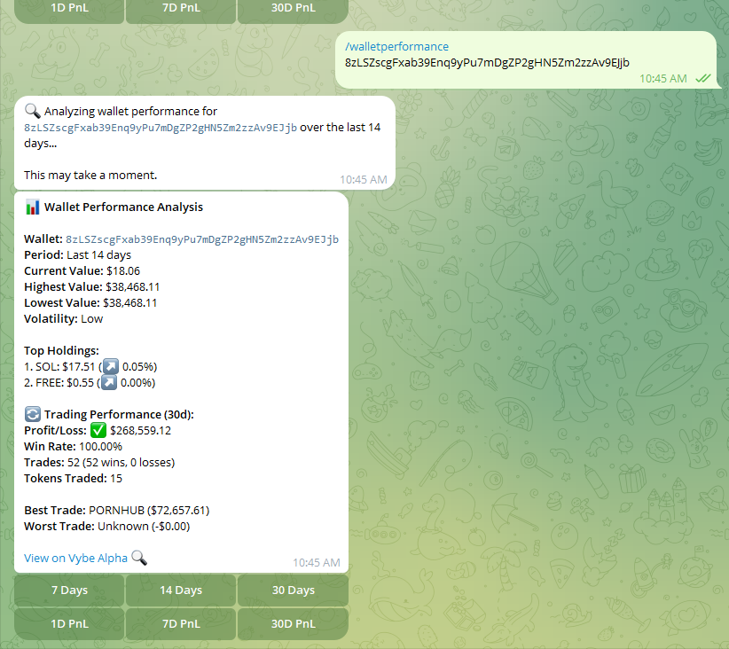
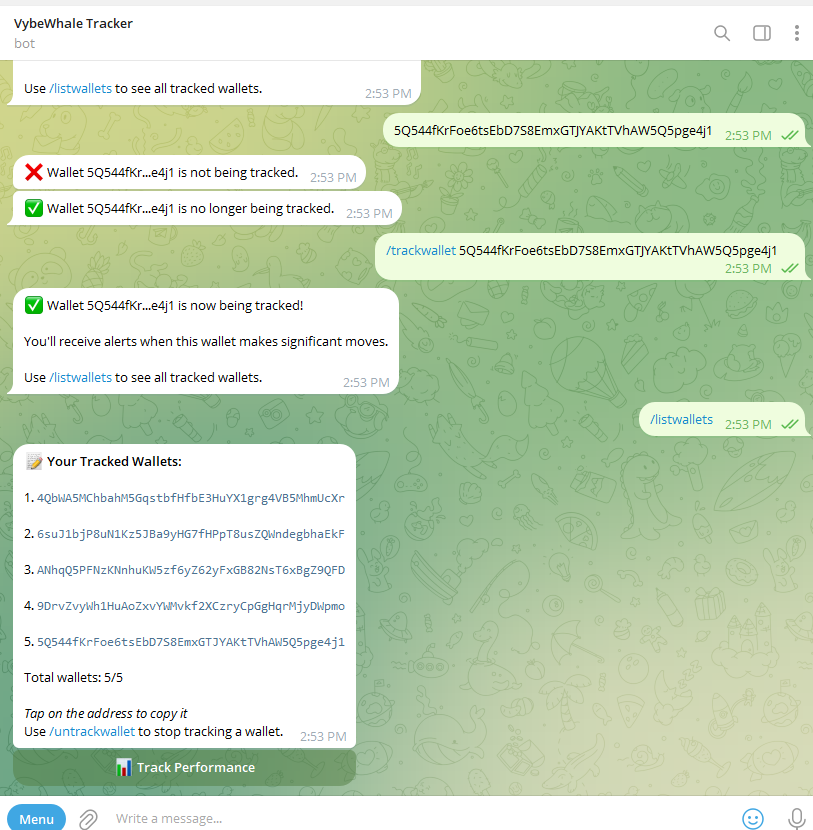

# VybeWhale Telegram Bot: Real-time Solana whale tracking using Vybe APIs.

A powerful Telegram bot that delivers real-time on-chain analytics for Solana tokens using Vybe APIs.

## 🌟 Features

- **Token Analysis**: Get detailed token information including price, market cap, supply metrics, holder trends, and whale distribution
- **Risk Assessment**: Get insights about whale concentration and potential price volatility
- **Whale Watch**: View whale insights, activity & risk assessment for any Solana token
- **Wallet Performance Tracking**: Analyze any wallet's performance with detailed metrics on holdings, value changes, and trading activity
- **Trading PnL Analysis**: Get comprehensive Profit & Loss data for any wallet including win rates, best performers, and ROI metrics
- **Easy Wallet Tracking**: Manage and track up to 5 wallets with detailed performance analytics
- **Vybe Alpha Integration**: Direct links to the Vybe Alpha platform for deeper analysis
- **Smart Fallbacks**: When API timeouts occur, provides direct links to Vybe Network for detailed analysis
- **Memory System**: Remembers your last analyzed token for quick follow-up lookups

> **Note:** Wallet Alert System is currently under development. Future updates will include real-time alerts for wallet transfers, significant trades, and custom notifications based on user-defined criteria.

## 📱 Demo

[Try the bot: @vybewhalebot](https://t.me/vybewhalebot)

## 🔧 Installation

1. Clone the repository

```bash
git clone https://github.com/italiancode/VybeWhale-Bot.git
cd VybeWhale-Bot
```

2. Install dependencies with `npm install`

3. Create a `.env` file with your:

   - TELEGRAM_BOT_TOKEN (from @BotFather)
   - VYBE_API_KEY (from https://vybe.fyi/settings/api)
   - VYBE_API_BASE_URL
   - DEFAULT_WHALE_THRESHOLD (optional, default 5000)

4. Run the bot with `npm start`

## 🚀 Getting Started

Start the bot by sending the `/start` command to get a welcome message with quick start instructions:

<div align="center">
  
</div>

## 📊 Usage Examples

### Token Analysis

Send `/token [token_address]` to get detailed information about any Solana token, including:

- Price, market cap, and supply metrics
- Holder count and trend analytics
- Whale distribution with concentration risk assessment
- Top holder information and exchange holdings
- Direct link to detailed token analytics

<div align="center">
  
</div>

### Whale Watch

Send `/whale [token_address]` to get comprehensive whale information for any token:

- Top 5 token holders with percentage of supply and USD value
- Recent whale activity with detailed transfer information
- Whale concentration risk assessment
- One-click tracking buttons to follow any whale wallet

<div align="center">
  
</div>

### Wallet Performance

Send `/walletperformance [wallet_address]` or use the performance tracking feature from `/listwallets` to analyze any wallet:

- Current value, highest and lowest value over the selected time period
- Performance metrics with volatility assessment
- Top token holdings with values and price changes
- Comprehensive trading performance (PnL) data including win rates and trade counts
- View performance over different time periods (7, 14, or 30 days)

### Trading Analysis (PnL)

Access detailed trading performance for any wallet:

- Total, realized, and unrealized Profit & Loss
- Win rate and trade statistics
- Top performing tokens with ROI metrics
- Detailed breakdown of trading activity
- Trade analysis across different time periods (1, 7, or 30 days)

<div align="center">
  
  <p><i>Add a screenshot of the wallet performance analysis here</i></p>
</div>

### Wallet Tracking

Track up to 5 wallets for ongoing analysis:

- Use `/trackwallet [wallet_address]` to add a wallet to your tracking list
- View all tracked wallets with `/listwallets`
- Remove wallets using `/untrackwallet [wallet_address]`
- Analyze any tracked wallet with a single click

<div align="center">
  
  <p><i>Add a screenshot of the wallet tracking interface here</i></p>
</div>

> **Coming Soon:** Receive alerts for significant wallet activities like large transfers, swaps, and value changes.

## 💻 Technical Implementation

- Node.js backend using the `node-telegram-bot-api` library
- Redis for state management and caching
- Optimized API calls to handle high-volume tokens
- Error handling with smart fallbacks to web interface
- Structured command handling with separation of concerns
- Comprehensive logging system for debugging and analytics

## 📝 Available Commands

- `/start` - Welcome message with quick start instructions
- `/help` - Display available commands and usage information
- `/token [ADDRESS]` - Get detailed token information and metrics
- `/whale [ADDRESS]` - View comprehensive whale insights and activity
- `/walletperformance [ADDRESS]` - Analyze any wallet's performance, holdings, and trading activity
- `/trackwallet [ADDRESS]` - Start tracking a wallet address for ongoing analysis
- `/untrackwallet [ADDRESS]` - Stop tracking a wallet address
- `/listwallets` - View all wallets you're currently tracking with quick analysis options
- `/config` - View and manage your current configuration
- `/setthreshold [AMOUNT]` - Set minimum USD value for whale alerts
- `/enablealerts [TYPE]` - Enable specific types of alerts (whale/wallet/all)
- `/disablealerts [TYPE]` - Disable specific types of alerts (whale/wallet/all)

## 🏆 Project Summary

VybeWhale bot delivers real-time Solana token analytics and whale insights directly in Telegram chats. The bot features a robust token analyzer with comprehensive market data, a standout whale watch system that combines top holder data with activity monitoring to provide risk assessment, and advanced wallet performance tracking capabilities.

Key features include:

- **Complete Token Analytics**: Comprehensive market data, supply metrics, and risk assessment
- **Whale Monitoring**: Top holder tracking with concentration and risk metrics
- **Wallet Performance Dashboard**: Detailed tracking of wallet value, holdings, and performance over time
- **Trading PnL Analysis**: In-depth profit and loss metrics for trader analysis
- **Alpha Integration**: Seamless links to the Vybe Alpha platform for deeper analysis

Technical innovations include API optimization that dynamically adjusts request parameters based on token volume, multi-level fallback systems that ensure users always get value even when facing API limitations, and seamless integration with Vybe Network's web interface for deeper analysis.

## 💼 Commercial Viability

VybeWhale Bot has significant potential in the crypto market:

### Monetization

- **Premium Features**: Offer higher wallet tracking limits, advanced PnL analytics, and priority API access
- **Trader Insights**: Provide advanced trading signals and performance forecasting
- **White Label Solutions**: Brand the bot for crypto projects' communities
- **Enterprise Use**: License to trading firms and crypto funds

### Scalability

- **API Integration Hub**: Centralize multiple data sources
- **Community Features**: Modular design for rapid iteration
- **Custom Alerts**: Personalized notification system based on wallet activity (coming soon)

### Market Advantage

- **Real-Time Insights**: Actionable data for traders
- **User-Friendly**: Accessible to non-technical users
- **Network Effect**: Each tracked wallet benefits the entire user base
- **Trading Performance**: Unique PnL analysis not commonly available in other tools

## 🔗 Deployment

Deploy to Telegram:

1. Create a bot with @BotFather.
2. Host on a cloud service (e.g., Heroku, Render).
3. Set environment variables.
4. Add to Telegram channels/groups with admin permissions.

[Deployed Bot Link](https://t.me/vybewhalebot)

## 📄 License

MIT License - see [LICENSE](LICENSE) for details.

Built with ❤️ by Agbaka Daniel Ugonna Matthew (Big Dreams Web3)
