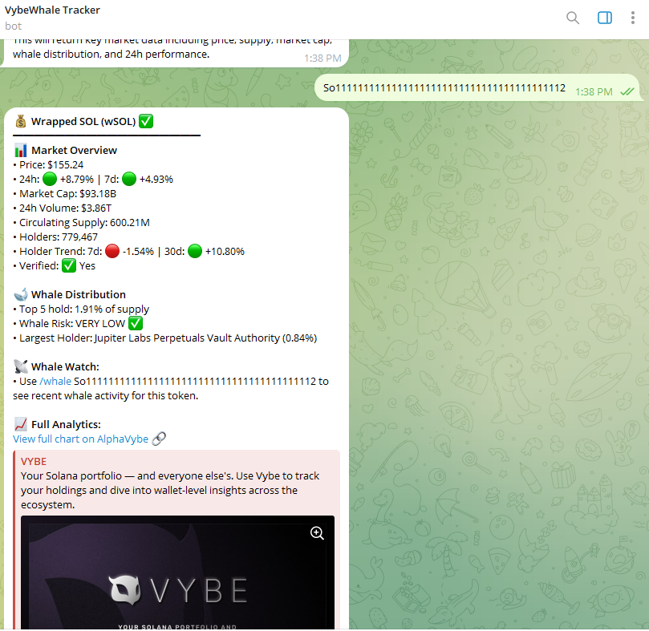
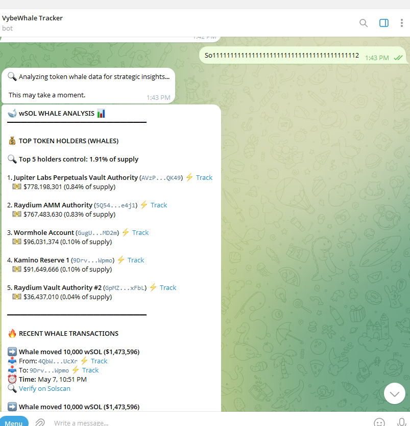

# Vybe Telegram Bot

A powerful Telegram bot that delivers real-time on-chain analytics for Solana tokens using Vybe APIs.

## Features

- **Token Analysis**: Get comprehensive token information including price, supply, and market cap
- **Whale Transaction Tracking**: Monitor large transactions (whale movements) for any Solana token
- **Smart Fallback System**: When API timeouts occur, provides direct links to Vybe Network for detailed analysis
- **Memory System**: Remembers the last token you analyzed for quick lookups

## Demo

[Try the bot: @vybewhalebot](https://t.me/vybewhalebot)

## Installation

1. Clone the repository

```bash
git clone https://github.com/italiancode/VybeWhale-Bot.git
cd VybeWhale-Bot
```

2. Install dependencies with `npm install`

3. Create a `.env` file with your:

   - TELEGRAM_BOT_TOKEN (from @BotFather)
   - VYBE_API_KEY (from @EricVybe)
   - VYBE_API_BASE_URL
   - DEFAULT_WHALE_THRESHOLD (optional, default 5000)

4. Run the bot with `npm start`

## Getting Started

Start the bot by sending the `/start` command:


## Usage Examples

### Token Analysis

Send `/token [token_address]` to get detailed information about any Solana token.

Example response:



### Whale Tracking

Send `/whale [token_address]` to track large transactions for any token.

Example response:



## API Behavior and Limitations

During development and testing, we observed several important characteristics of the Vybe API:

### Whale Transaction API

- **Token Coverage**: The whale transaction API primarily supports established tokens with significant trading volume. Newer, less popular, or custom tokens may not be tracked.
- **API Response Structure**: The API may return transactions in different formats depending on the token. Our implementation carefully handles these variations.
- **No-Data Handling**: For tokens without data, the bot provides helpful information explaining possible reasons and directs users to Vybe Network for additional analysis.

## Technical Implementation

- Node.js backend using the `node-telegram-bot-api` library
- Redis for state management and caching
- Optimized API calls to handle high-volume tokens
- Error handling with smart fallbacks to web interface

## Available Commands

- `/start` - Initialize the bot and get welcome message
- `/help` - Display available commands and usage information
- `/token [ADDRESS]` - Get detailed token information and metrics
- `/whale [ADDRESS]` - View recent whale transactions for a token
- `/trackwallet [ADDRESS]` - Start tracking a wallet address
- `/untrackwallet [ADDRESS]` - Stop tracking a wallet address
- `/listwallets` - View all wallets you're currently tracking
- `/setthreshold [AMOUNT]` - Set minimum USD value for whale alerts
- `/enablealerts [TYPE]` - Enable specific types of alerts
- `/disablealerts [TYPE]` - Disable specific types of alerts

## Project Summary

VybeWhale bot delivers real-time Solana token analytics and whale alerts directly in Telegram chats. The bot features a robust token analyzer with comprehensive market data and a standout whale transaction tracker that detects and reports large token movements with configurable thresholds.

Technical innovations include smart API optimization that dynamically adjusts request parameters based on token volume, multi-level fallback systems that ensure users always get value even when facing API limitations, and seamless integration with Vybe Network's web interface for deeper analysis.

## License

This project is licensed under the MIT License - see the [LICENSE](LICENSE) file for details.

Built with ❤️ by Agbaka Daniel Ugonna Matthew (Big Dreams Web3)
